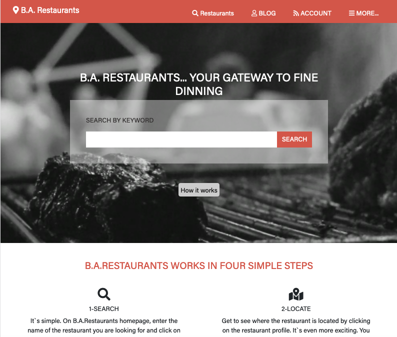

# [HTML & CSS capstone project: Directory of Restaurants

> Directory of restaurants

## Live link

- https://raw.githack.com/afcastaneda223/Directory-of-Restaurants/Develop/index.html

## Built With

- HTML,
- CSS,

## GitHub Repo

-  https://github.com/afcastaneda223/Directory-of-Restaurants

## Author

👤 **Andres Felipe Castañeda Ramos**

- Github: [@afcastaneda223](https://github.com/afcastaneda223)
- Twitter: [@afcastaneda](https://twitter.com/afcastaneda)
- Linkedin: [Andres Felipe Castañeda](www.linkedin.com/in/andres-castaneda223)

## Show your support

Give a ⭐️ if you like this project!

## Acknowledgments

- Microverse
- [https://coverr.co/] for the awsome cover.
- Special thanks to Mathew Njuguna [https://www.behance.net/mathewnjuguna] & Sam Achola [https://www.behance.net/aweSam]
- Design idea by [Mathew Njuguna and others on Behance](https://www.behance.net/mathewnjuguna) info (layouts) follow in this link [https://www.behance.net/gallery/25563385/PatashuleKE]

## 📝 License

Distributed by the Creative Commons Legal Code. See `LICENSE` for more information.
